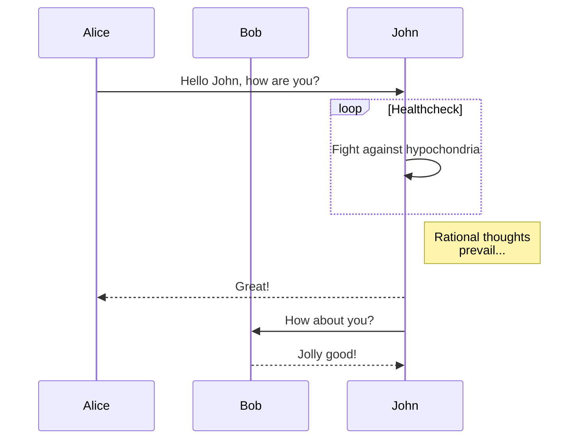
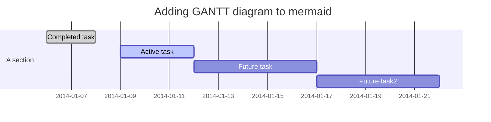
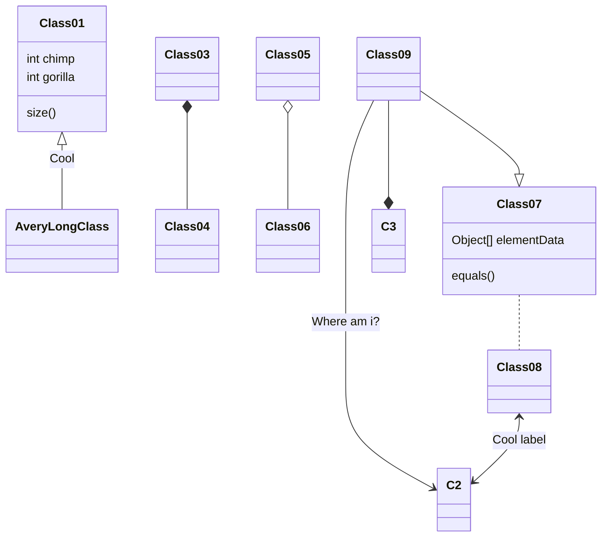

Examples taken from the [Mermaid repository](https://github.com/knsv/mermaid)

## Example 1: Flowchart

## Example 2: Sequence diagram

## Example 3: Gantt diagram

## Example 4: Class diagram

## Example 5: Git graph

